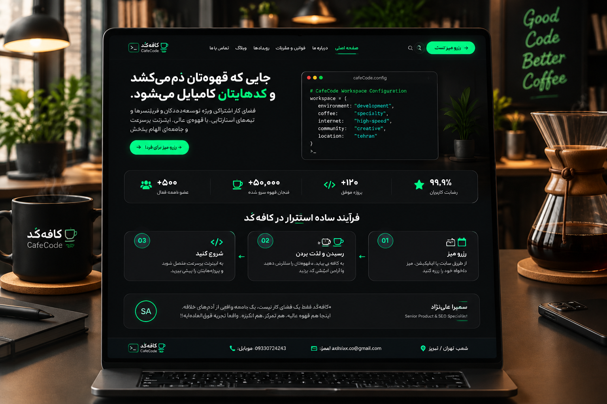

# 🚀 کافه‌کُد (CafeCode) — لندینگ‌پیج تخصصی فضای کار اشتراکی

طراحی و پیاده‌سازی لندینگ‌پیج دارک‌مود با تمرکز بر جامعه توسعه‌دهندگان و برنامه‌نویسان، منطبق بر اصول **Webnjoy UI/UX Design System**.

🔗 **[مشاهده دموی زنده پروژه (Live Demo)](https://astoriax.github.io/cafecode-landing-page/)**

---

## 🛠 مشخصات فنی و استانداردهای پیاده‌سازی
- **گرید سیستم:** گرید استاندارد ۸ پیکسلی (8pt Grid System)
- **پالت رنگی دارک:** کنتراست مطابق با استاندارد WCAG AAA (رنگ پایه: `#121212`، رنگ اکسنت: نئون گرین `#00FF66`)
- **تایپوگرافی:** رعایت مقیاس تایپوگرافی (H1 تا Body) با فونت‌های بهینه‌شده Vazirmatn و JetBrains Mono
- **نام‌گذاری ساختاریافته:** رعایت قرارداد `Section_Block_Element` در تمام المان‌ها و لایه‌ها
- **عملکرد و پرفورمنس:** بارگذاری فوق‌سریع بدون وابستگی سنگین، کاملاً ریسپانسیو (Mobile-First)

## 👤 توسعه و بهینه‌سازی
- **طراح و توسعه‌دهنده:** سمیرا علی‌نژاد
- **ایمیل:** astoriax.co@gmail.com
- **تماس:** 09330724243
